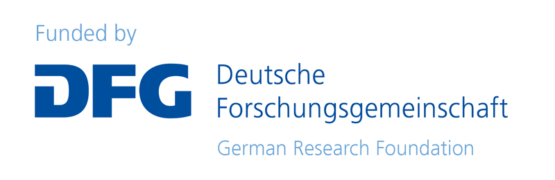

<p align="right">
   
   
</p>

[](https://doi.org/10.5281/zenodo.1234567)

# Bioimage Data Workflow for Plasma Medicine
This repository contains relevant Jupyter notebooks for the bioimage data workflow (published on [Zenodo](https://doi.org/10.5281/zenodo.16412003)) designed at the Leibniz Institute for Plasma Science and Technology as part of the [NFDI4Bioimage consortium](https://nfdi4bioimage.de/home/).
The provided notebook is used for annotating images in the image database [OMERO](https://www.openmicroscopy.org/omero/) with metadata from the electronic laboratory notebook [eLabFTW](https://www.elabftw.net/). The metadata collection proposed in this workflow is carried-out using [Adamant](https://github.com/plasma-mds/adamant).

## Changelog
### [x.x.x] November xx, 2025
* Initial release of the GitHub repository

## Set up
A running Jupyter environment is necessary to run the provided notebooks.
All notebooks were designed and tested on Python 3.12.5.
In case of need follow the [installation guideline](https://jupyter.org/install).

## Dependencies 
Mostly depends on your set up Python environment but here is a short list of the important dependencies
* [**Elabapi**](https://pypi.org/project/elabapi-python/)
* [**OMERO-py**](https://pypi.org/project/omero-py/)
* [**Openpyxl**](https://pypi.org/project/openpyxl/)
* [**Pandas**](https://pypi.org/project/pandas/)

## Usage
To use the provided Jupyter notebooks, the two Python scripts [omerohandler.py](scripts/omerohandler.py) and [elabftwapihandler.py](scripts/elabftwapihandler.py) must be located in the same working directory as the notebook.
To access the respective OMERO and eLabFTW instances, the host addresses must be adjusted in the respective handler scripts.
### eLabFTW
The codeline (l. 43) in elabftwapihandler.py has to be changed:
```
configuration.host = 'hostAdress'
```
the 'hostAdress' variable has to be replaced by the actual host url adress of your eLabFTW instance

### OMERO
The codeline (l. 21) in omerohandler.py has to be changed:
```
conn = BlitzGateway(usrname, passwrd, host= hostAdress, port= hostPort, secure=True)
```
the 'hostAdress' variable has to be replaced by the actual host url adress of your OMERO instance

## Support
In case of found bugs or problems please use GitHub issues.
Support is available by:
  * Robert Wagner (robert.wagner@inp-greifswald.de)
  * Dr. Mohsen Ahmadi (mohsen.ahmadi@inp-greifswald.de)
  * Dr. Markus Becker (markus.becker@inp-greifswald.de)

## Grant information
The work is funded by the Deutsche Forschungsgemeinschaft (DFG, German Research Foundation) under the National Research Data Infrastructure – NFDI 46/1 – 501864659



